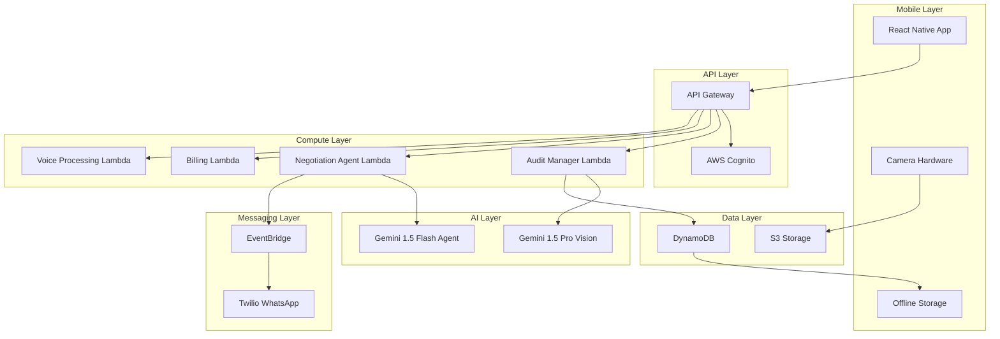

# Design Document: Insper Retail Operating System

## Overview

Insper is an AI-powered "Zero-Touch" Retail Operating System designed for India's unorganized retailers (Kirana stores). The system transforms smartphones into intelligent inventory auditors and autonomous procurement managers, addressing critical market failures through a serverless, event-driven architecture that ensures scalability and cost-efficiency.

The system follows a "Bharat-Ready" design philosophy, creating interfaces that remove barriers of typing and literacy while maintaining user control through strategic "Trust Gate" interactions.

## Architecture

### High-Level Architecture

Insper utilizes a serverless, event-driven architecture with the following layers:



### Core Design Principles

1. **Visual-First Interface**: Grid-based tile views that mimic physical shopping experiences
2. **Voice-First Navigation**: Persistent voice command interface for hands-free operation
3. **Trust Gate Pattern**: Strategic human confirmation points for autonomous AI decisions
4. **Offline-First**: Local storage with intelligent synchronization
5. **Zero-Learning Curve**: Intuitive interactions requiring no training

## Components and Interfaces

### Frontend Layer: React Native Application

**Core Components:**

1. **Visual POS Module**
   - Grid-based tile view with high-contrast product imagery
   - Large touch targets (minimum 44px) for variable lighting conditions
   - Tap-to-add cart functionality mimicking physical item selection
   - Real-time inventory updates with visual stock indicators

2. **Camera Integration Module**
   - Direct native camera hardware access for high-quality video capture
   - Automatic frame optimization for inventory analysis
   - Progress indicators during video processing
   - Offline video storage with sync queuing

3. **Voice Command Interface**
   - Persistent voice activation button
   - Multi-language speech recognition (Hindi, Tamil, Kannada, Telugu + 6 others)
   - Contextual voice feedback and confirmation
   - Fallback to visual interface when voice recognition fails

4. **Trust Gate UI Components**
   - Decision cards with clear deal summaries
   - Large, prominent approval/rejection buttons
   - Transaction history with visual timelines
   - Supplier rating and feedback system

**State Management:**
- Redux with offline-first architecture
- Local SQLite database for critical data
- Intelligent sync queue with conflict resolution
- Background sync with exponential backoff

### Backend Layer: AWS Lambda Functions

**Audit Manager Lambda (Python)**
```python
# Triggered by S3 video upload events
def audit_handler(event, context):
    # Process video through Gemini 1.5 Pro
    # Update DynamoDB inventory records
    # Trigger gap analysis
    # Send notifications for critical stock levels
```

**Negotiation Agent Lambda (Python)**
```python
# Triggered by bulk order formation
def negotiation_handler(event, context):
    # Initialize reverse auction
    # Generate supplier messages via Gemini 1.5 Flash
    # Route messages through EventBridge to Twilio
    # Track negotiation state and outcomes
```

**Billing Lambda (Python)**
```python
# Handles POS transactions
def billing_handler(event, context):
    # Process visual tile selections
    # Calculate totals and taxes
    # Update inventory levels
    # Generate digital receipts
```

**Voice Processing Lambda (Python)**
```python
# Processes voice commands
def voice_handler(event, context):
    # Convert speech to text
    # Parse intent and entities
    # Execute corresponding actions
    # Generate voice responses
```

### AI Integration Layer

**Google Gemini 1.5 Pro (Vision Analysis)**
- Video frame analysis for inventory counting
- Product identification and categorization
- Quality assessment and expiry date detection
- Gap analysis for missing essential items

**Google Gemini 1.5 Flash (Conversational Agent)**
- Natural language generation for supplier negotiations
- Multi-turn conversation management
- Local dialect adaptation
- Context-aware response generation

### Data Layer Architecture

**DynamoDB Tables:**

1. **Inventory Table**
   - Partition Key: store_id
   - Sort Key: product_id
   - Attributes: quantity, last_updated, category, price, supplier_info
   - GSI: category-index for product browsing

2. **Store Table**
   - Partition Key: store_id
   - Attributes: owner_info, location, geo_coordinates, preferences
   - GSI: geo-index for proximity searches

3. **Transaction Table**
   - Partition Key: store_id
   - Sort Key: transaction_timestamp
   - Attributes: items, total, payment_method, customer_info

4. **Negotiation Table**
   - Partition Key: bulk_order_id
   - Sort Key: timestamp
   - Attributes: participants, messages, current_bids, status

**S3 Storage Structure:**
```
insper-storage/
├── videos/
│   ├── {store_id}/
│   │   └── {timestamp}-audit.mp4
├── processed/
│   ├── {store_id}/
│   │   └── {timestamp}-analysis.json
└── temp/
    └── 24hr-lifecycle/
```

## Data Models

### Core Data Structures

**Store Model:**
```typescript
interface Store {
  store_id: string;
  owner_name: string;
  phone_number: string;
  location: GeoLocation;
  preferred_language: Language;
  business_hours: BusinessHours;
  inventory_last_updated: timestamp;
  trust_score: number;
}
```

**Product Model:**
```typescript
interface Product {
  product_id: string;
  name: LocalizedString;
  category: ProductCategory;
  unit_type: UnitType;
  current_stock: number;
  min_threshold: number;
  max_capacity: number;
  supplier_info: SupplierInfo[];
  last_audit_timestamp: timestamp;
}
```

**BulkOrder Model:**
```typescript
interface BulkOrder {
  bulk_order_id: string;
  product_id: string;
  participating_stores: string[];
  total_quantity: number;
  target_price: number;
  auction_status: AuctionStatus;
  winning_supplier: string;
  delivery_timeline: timestamp;
}
```

**Negotiation Model:**
```typescript
interface Negotiation {
  negotiation_id: string;
  bulk_order_id: string;
  supplier_id: string;
  message_thread: Message[];
  current_offer: PriceOffer;
  negotiation_status: NegotiationStatus;
  ai_confidence_score: number;
}
```

## Correctness Properties

*A property is a characteristic or behavior that should hold true across all valid executions of a system—essentially, a formal statement about what the system should do. Properties serve as the bridge between human-readable specifications and machine-verifiable correctness guarantees.*

### Inventory Analysis Properties

**Property 1: AI Processing Universality**
*For any* video or photo input captured through the smartphone camera, the Eye_Module should successfully process the visual data using Google Gemini 1.5 Pro and return structured inventory data
**Validates: Requirements 1.1**

**Property 2: Inventory Counting Accuracy**
*For any* inventory analysis operation, the Eye_Module should maintain 90% accuracy in stock counting across different lighting conditions and product arrangements
**Validates: Requirements 1.2, 11.1**

**Property 3: Automated Digitization**
*For any* completed inventory analysis, the Eye_Module should digitize stock information without requiring any manual text input from the user
**Validates: Requirements 1.3**

**Property 4: Performance Compliance**
*For any* visual data processing operation, the system should complete analysis within 60 seconds maximum latency while maintaining acceptable response times for all core functions
**Validates: Requirements 1.4, 11.2**

**Property 5: Storage Policy Compliance**
*For any* generated inventory data, the Eye_Module should store results in S3 with proper 24-hour lifecycle policy configuration
**Validates: Requirements 1.5**

**Property 6: Gap Detection and Notification**
*For any* inventory state where essential items are missing, the Eye_Module should identify gaps and notify the store owner appropriately
**Validates: Requirements 1.6**

### Demand Aggregation Properties

**Property 7: Geographic Proximity Calculation**
*For any* geo-fencing activation, the Hive_Module should accurately identify nearby Kirana stores within the specified 1-2km radius using precise geographic calculations
**Validates: Requirements 2.1**

**Property 8: Demand Aggregation Logic**
*For any* set of stores with similar product demands, the Hive_Module should correctly aggregate demand quantities across all participating stores
**Validates: Requirements 2.2**

**Property 9: Bulk Threshold Enforcement**
*For any* aggregated demand calculation, the Hive_Module should create bulk order requests if and only if the total exceeds the 50kg bulk threshold
**Validates: Requirements 2.3**

**Property 10: Auction Initiation Consistency**
*For any* created bulk order, the Hive_Module should initiate the reverse auction process with appropriate local suppliers
**Validates: Requirements 2.4**

**Property 11: Competitive Bidding Structure**
*For any* active auction with supplier participation, the Hive_Module should facilitate competitive bidding with proper decreasing price structure and fair competition rules
**Validates: Requirements 2.5**

**Property 12: Winner Presentation Workflow**
*For any* concluded auction, the Hive_Module should present winning bids to all participating store owners for approval before proceeding
**Validates: Requirements 2.6**

### Negotiation Agent Properties

**Property 13: WhatsApp Integration Reliability**
*For any* negotiation scenario, the Hand_Module should successfully integrate with suppliers via WhatsApp using Twilio API with proper message delivery and error handling
**Validates: Requirements 3.1, 12.2**

**Property 14: AI-Powered Communication**
*For any* supplier communication, the Hand_Module should use Google Gemini 1.5 Flash for natural language generation and produce contextually appropriate responses
**Validates: Requirements 3.2**

**Property 15: Multi-Language Negotiation**
*For any* negotiation conversation, the Hand_Module should conduct multi-turn conversations in the appropriate local dialect based on supplier and store owner preferences
**Validates: Requirements 3.3, 10.4**

**Property 16: Human Confirmation Gate**
*For any* negotiation that reaches conclusion, the Hand_Module should require explicit human confirmation before finalizing any transactions
**Validates: Requirements 3.4**

**Property 17: Autonomous Conversation Handling**
*For any* supplier response during negotiation, the Hand_Module should interpret the message and continue negotiation autonomously while maintaining conversation context
**Validates: Requirements 3.5**

**Property 18: Transaction Detail Presentation**
*For any* agreed final terms, the Hand_Module should present complete transaction details to the store owner in a clear, understandable format for approval
**Validates: Requirements 3.6**

### Visual POS Properties

**Property 19: Visual Tile Display**
*For any* customer transaction processing, the Smart_Billing_Module should display visual product tiles with clear product images and intuitive navigation
**Validates: Requirements 4.1**

**Property 20: No-Text-Input Billing**
*For any* product selection during billing, the Smart_Billing_Module should enable complete tap-to-bill functionality without requiring any text input from the user
**Validates: Requirements 4.2**

**Property 21: Automatic Calculation**
*For any* set of selected products, the Smart_Billing_Module should automatically calculate total amounts and generate bills with accurate pricing and tax calculations
**Validates: Requirements 4.3**

**Property 22: Real-Time Inventory Updates**
*For any* completed billing transaction, the Smart_Billing_Module should immediately update inventory levels in real-time to maintain accurate stock counts
**Validates: Requirements 4.4**

**Property 23: Category Organization**
*For any* product display, the Smart_Billing_Module should organize products by categories to enable easy navigation and product discovery
**Validates: Requirements 4.5**

### Voice Command Properties

**Property 24: Comprehensive Language Support**
*For any* voice command input, the Voice_Command_Module should support processing in Hindi, Tamil, Kannada, Telugu, and 6 additional Indian languages with consistent functionality across all languages
**Validates: Requirements 5.1, 10.1, 10.3**

**Property 25: Speech Recognition Accuracy**
*For any* spoken command from store owners, the Voice_Command_Module should convert speech to text with high accuracy and handle various accents and speech patterns
**Validates: Requirements 5.2**

**Property 26: Complete Voice Control**
*For any* app function, the Voice_Command_Module should enable full operation without requiring manual interface interaction
**Validates: Requirements 5.3**

**Property 27: Clarification Handling**
*For any* unclear or ambiguous voice command, the Voice_Command_Module should request clarification in the user's preferred language
**Validates: Requirements 5.4**

**Property 28: Audio Feedback Consistency**
*For any* voice input received, the Voice_Command_Module should provide audio feedback confirming the actions taken
**Validates: Requirements 5.5**

### Offline Functionality Properties

**Property 29: Offline Operation Continuity**
*For any* network connectivity loss, the Insper_System should continue core operations in offline mode without data loss or functionality degradation
**Validates: Requirements 6.1**

**Property 30: Local Data Persistence**
*For any* transaction or operation performed offline, the Insper_System should store data locally on the device with proper data integrity
**Validates: Requirements 6.2**

**Property 31: Automatic Synchronization**
*For any* network connectivity restoration, the Insper_System should automatically sync all offline data with cloud services without user intervention
**Validates: Requirements 6.3**

**Property 32: Conflict Resolution Strategy**
*For any* sync conflict that occurs, the Insper_System should prioritize local data and flag conflicts for user resolution with clear conflict information
**Validates: Requirements 6.4**

**Property 33: Connectivity Status Indication**
*For any* offline mode activation, the Insper_System should clearly indicate connectivity status to users through visual and audio cues
**Validates: Requirements 6.5**

### Scalability Properties

**Property 34: Auto-Scaling Behavior**
*For any* increase in request volume, the Insper_System should automatically scale AWS Lambda functions to handle load while maintaining performance
**Validates: Requirements 7.1**

**Property 35: High Concurrency Performance**
*For any* load scenario up to 10,000 concurrent requests, the Insper_System should maintain response times within acceptable limits
**Validates: Requirements 7.2**

**Property 36: API Gateway Management**
*For any* scaling event, the Insper_System should properly utilize API Gateway for REST architecture management and request routing
**Validates: Requirements 7.3**

**Property 37: Database Auto-Scaling**
*For any* data storage requirement, the Insper_System should utilize DynamoDB with automatic scaling to handle varying loads
**Validates: Requirements 7.4**

**Property 38: Cost Optimization**
*For any* decrease in system load, the Insper_System should scale down resources appropriately to optimize operational costs
**Validates: Requirements 7.5**

### Data Privacy Properties

**Property 39: Store Data Isolation**
*For any* business data storage or access, the Insper_System should maintain complete isolation between competing stores' data
**Validates: Requirements 8.1**

**Property 40: Privacy-Preserving Aggregation**
*For any* demand aggregation participation, the Insper_System should share only necessary aggregated quantities while keeping individual store details private
**Validates: Requirements 8.2**

**Property 41: Comprehensive Data Encryption**
*For any* sensitive business information processing, the Insper_System should apply appropriate encryption to protect data confidentiality
**Validates: Requirements 8.3**

**Property 42: Access Control Enforcement**
*For any* data access attempt, the Insper_System should authenticate and authorize users before providing access to store-specific information
**Validates: Requirements 8.4**

**Property 43: Breach Response Protocol**
*For any* detected data breach, the Insper_System should immediately isolate affected accounts and notify relevant parties according to security protocols
**Validates: Requirements 8.5**

### User Experience Properties

**Property 44: Error Feedback Provision**
*For any* error that occurs, the Insper_System should provide clear visual and audio feedback in the user's preferred language
**Validates: Requirements 9.3**

**Property 45: Backward Compatibility**
*For any* new feature introduction, the Insper_System should integrate seamlessly without disrupting existing workflows
**Validates: Requirements 9.4**

**Property 46: Contextual Help Availability**
*For any* help request, the Insper_System should provide contextual assistance through voice guidance appropriate to the current app state
**Validates: Requirements 9.5**

### Localization Properties

**Property 47: Complete UI Localization**
*For any* interface element display, the Insper_System should render all text in the user's selected language with proper cultural adaptation
**Validates: Requirements 10.2**

**Property 48: Notification Localization**
*For any* system notification, the Insper_System should deliver messages in the user's preferred language with appropriate cultural context
**Validates: Requirements 10.5**

### System Reliability Properties

**Property 49: Automatic Recovery**
*For any* system failure, the Insper_System should implement automatic recovery mechanisms to restore functionality
**Validates: Requirements 11.3**

**Property 50: Maintenance Scheduling**
*For any* required maintenance, the Insper_System should schedule updates during low-usage periods to minimize user disruption
**Validates: Requirements 11.4**

**Property 51: Performance Monitoring**
*For any* performance degradation, the Insper_System should alert administrators and implement fallback procedures
**Validates: Requirements 11.5**

### API Integration Properties

**Property 52: API Resilience**
*For any* third-party API integration (Google Gemini, Twilio, AWS), the Insper_System should handle rate limits, errors, and service unavailability gracefully with appropriate fallback mechanisms
**Validates: Requirements 12.1, 12.3, 12.4**

**Property 53: API Compatibility Management**
*For any* API version changes, the Insper_System should maintain backward compatibility during transition periods
**Validates: Requirements 12.5**

## Error Handling

### Error Categories and Strategies

**1. Network and Connectivity Errors**
- Automatic retry with exponential backoff
- Graceful degradation to offline mode
- User notification with clear recovery instructions
- Background sync queue for failed operations

**2. AI Service Errors**
- Fallback to cached results when available
- Alternative processing methods for critical functions
- User notification with manual override options
- Error logging for service improvement

**3. Data Validation Errors**
- Input sanitization and validation at all entry points
- Clear error messages in user's preferred language
- Automatic correction suggestions where possible
- Rollback mechanisms for data integrity

**4. Authentication and Authorization Errors**
- Secure token refresh mechanisms
- Clear re-authentication prompts
- Session management with appropriate timeouts
- Audit logging for security monitoring

**5. Business Logic Errors**
- Transaction rollback for failed operations
- Compensation actions for partial failures
- User confirmation for critical operations
- Detailed error reporting for debugging

## Testing Strategy

### Dual Testing Approach

The Insper system requires both unit testing and property-based testing to ensure comprehensive coverage:

**Unit Tests:**
- Focus on specific examples and edge cases
- Test integration points between modules
- Verify error conditions and boundary cases
- Test specific user scenarios and workflows

**Property-Based Tests:**
- Verify universal properties across all inputs
- Test system behavior with randomized data
- Validate correctness properties from design document
- Ensure comprehensive input coverage through randomization

### Property-Based Testing Configuration

**Testing Framework:** Hypothesis (Python) for backend Lambda functions, fast-check (TypeScript) for React Native components

**Test Configuration:**
- Minimum 100 iterations per property test
- Each property test references its design document property
- Tag format: **Feature: insper-retail-os, Property {number}: {property_text}**

**Property Test Implementation:**
- Each correctness property implemented by a single property-based test
- Comprehensive input generation for realistic test scenarios
- Automated verification of property compliance
- Integration with CI/CD pipeline for continuous validation

### Testing Coverage Requirements

**Backend Lambda Functions:**
- Unit tests for specific business logic scenarios
- Property tests for data processing and API interactions
- Integration tests for AWS service interactions
- Load tests for scalability validation

**React Native Application:**
- Unit tests for component behavior and state management
- Property tests for UI interactions and data flow
- Integration tests for offline/online synchronization
- End-to-end tests for critical user journeys

**AI Integration:**
- Mock tests for AI service interactions
- Property tests for data transformation and validation
- Performance tests for latency requirements
- Accuracy tests for inventory analysis

### Continuous Testing Strategy

**Automated Testing Pipeline:**
- Pre-commit hooks for unit test execution
- CI/CD integration for property-based testing
- Automated performance testing for scalability
- Regular security testing for data privacy

**Monitoring and Alerting:**
- Real-time performance monitoring
- Error rate tracking and alerting
- User experience metrics collection
- Business metrics monitoring for ROI validation